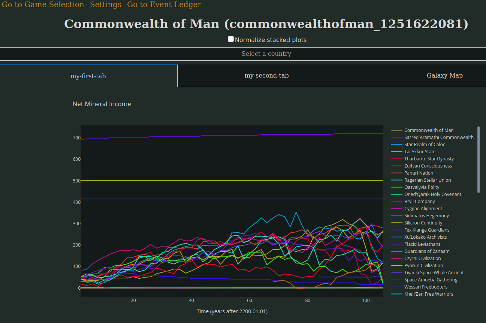

# Configuring the graph layout

The dashboard graphs can be freely arranged into tabs with some manual editing of the configuration file. 

Disabling some graphs means that the dashboard has to do less work, making it faster to browse. At the same time, this allows leaving only the graphs that matter to you and arranging them in whatever way you prefer.

The configuration is written in YAML format which is quite easy to understand. You can chose almost any name for the tabs, except for "Galaxy Map", which is reserved.

For example:
```yaml
tab_layout:
  my-first-tab:
    - net_mineral_income_graph
    - net_energy_income_graph
  my-second-tab:
    - system_count_graph
```
This will make the graph dashboard appear like this:



I strongly recommended to make a backup copy of the config.yml after customizing it, since the dashboard may overwrite changes. 

To reset the default layout, simply delete or move the config.yml file, or remove the `tab_layout` section from it.

Changes to the tab layout will only apply after restarting the dashboard.

## Graph IDs

- `planet_count_graph`
- `system_count_graph`
- `net_mineral_income_graph`
- `net_energy_income_graph`
- `net_alloys_income_graph`
- `net_consumer_goods_income_graph`
- `net_food_income_graph`
- `technology_progress_graph`
- `research_output_by_category_graph`
- `research_output_graph`
- `survey_progress_graph`
- `military_power_graph`
- `fleet_size_graph`
- `fleet_composition_graph`
- `species_distribution_graph`
- `species_happiness_graph`
- `species_power_graph`
- `species_crime_graph`
- `faction_distribution_graph`
- `faction_support_graph`
- `faction_approval_graph`
- `faction_crime_graph`
- `faction_power_graph`
- `faction_happiness_graph`
- `planet_pop_distribution_graph`
- `planet_migration_graph`
- `planet_amenities_graph`
- `planet_stability_graph`
- `planet_housing_graph`
- `planet_crime_graph`
- `planet_power_graph`
- `planet_happiness_graph`
- `ethos_distribution_graph`
- `ethos_crime_graph`
- `ethos_power_graph`
- `ethos_happiness_graph`
- `strata_distribution_graph`
- `strata_crime_graph`
- `strata_power_graph`
- `strata_happiness_graph`
- `job_distribution_graph`
- `job_crime_graph`
- `job_power_graph`
- `job_happiness_graph`
- `energy_budget`
- `mineral_budget`
- `consumer_goods_budget`
- `alloys_budget`
- `food_budget`
- `volatile_motes_budget`
- `exotic_gases_budget`
- `rare_crystals_budget`
- `living_metal_budget`
- `zro_budget`
- `dark_matter_budget`
- `nanites_budget`
- `influence_budget`
- `unity_budget`
- `victory_rank_graph`
- `victory_score_graph`
- `victory_economy_score_graph`
